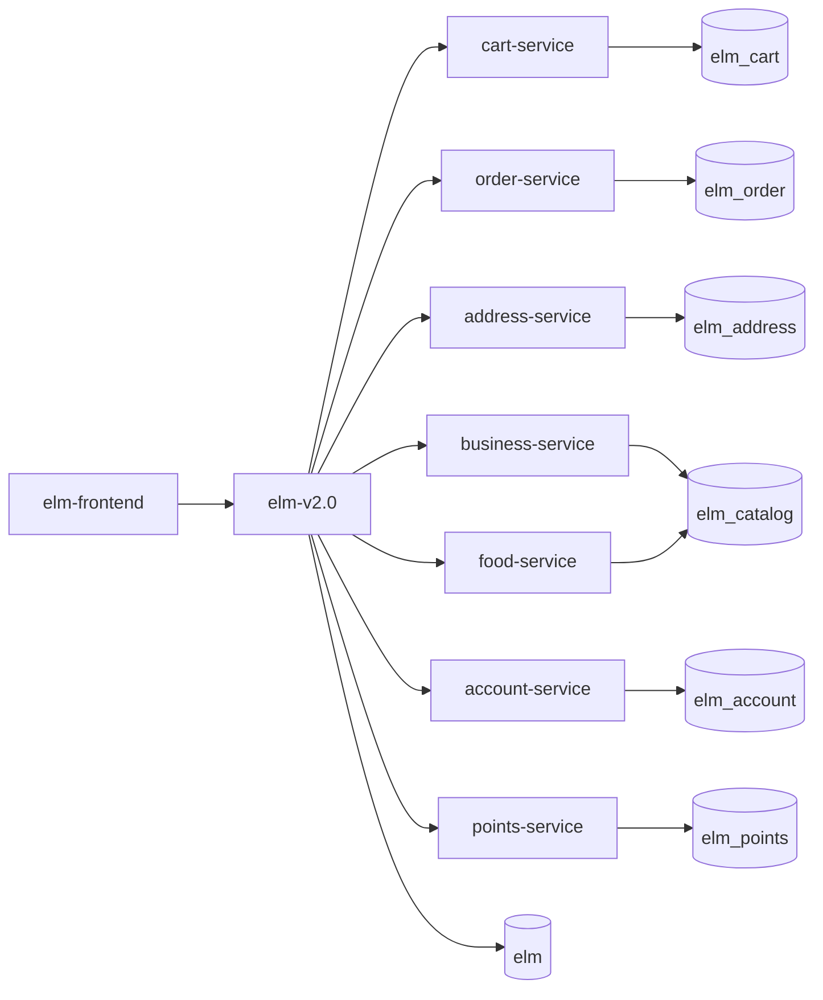

# ELM 微服务实践项目（TJU SE）

本仓库当前以 `elm-v2.0` 作为统一入口（外部 API 聚合层），内部通过 RestTemplate 调用 8 个已拆分微服务：`points-service`、`account-service`、`business-service`、`food-service`、`cart-service`、`order-service`、`address-service`、`user-service`。

## 1. 微服务业务调用流程

### 1.0 课程目标拆分与当前渐进实现

课程目标拆分：

- `business-service`：商家，集群部署
- `food-service`：食品，集群部署
- `cart-service`：购物车，集群部署
- `order-service`：订单，集群部署
- `address-service`：送货地址，单实例
- `user-service`：用户，单实例

结合当前仓库实现，现阶段采用渐进式拆分：

- `business-service` 已独立承载商家域，双实例部署
- `food-service` 已独立承载食品与库存域，双实例部署，并通过内部 HTTP 调用 `business-service` 校验商家归属
- `cart-service` 已独立承载购物车域，双实例部署
- `order-service` 继续承载订单与评价域，双实例部署
- `address-service` 已独立抽离为单实例服务，符合送货地址不集群化的课程要求
- `user-service` 已独立抽离为单实例服务，负责认证、JWT 签发、用户查询与注册
- `elm-v2.0` 当前保留外部 API 聚合、鉴权兼容层和跨域编排职责，对用户域改为远程调用 `user-service`
- `account-service`、`points-service` 属于课程要求之外的实践增强域服务，用于钱包、优惠券、积分等扩展能力

当前目标不是一次性推翻重做，而是在现有可运行链路上先补齐 Spring Cloud 治理能力、注册发现、配置中心和高可用实例，再继续做域拆分。

### 1.0.1 当前完成度对照

按课程要求核对，当前本地 `Spring Cloud + Eureka + Gateway` 运行模式已经满足下面这组目标：

- 六个目标微服务已独立存在：`business-service`、`food-service`、`cart-service`、`order-service`、`address-service`、`user-service`
- 商家、食品、购物车、订单四个服务已按双实例运行：
  - `business-service`: `8083` / `8183`
  - `food-service`: `8087` / `8187`
  - `cart-service`: `8089` / `8189`
  - `order-service`: `8084` / `8184`
- 送货地址、用户服务保持单实例：
  - `address-service`: `8085`
  - `user-service`: `8086`
- 食品微服务到商家微服务的内部调用关系已经落地：`food-service` 通过内部客户端调用 `business-service` 的 `/api/inner/business/{id}` 做商家存在性校验
- `order-service` 中旧的购物车实现已经删除，购物车域职责只保留在 `cart-service`

需要单独说明：

- 根目录 `docker-compose.yml` 已升级为 Spring Cloud 容器编排，包含 `config-server`、`discovery-server`、`gateway-service` 与 4 个双实例业务服务集群
- 当前“本地云模式”和“容器 compose 模式”在服务拆分目标上已经对齐：`business`、`food`、`cart`、`order` 为双实例，`address`、`user` 为单实例
- 运行态核验仍建议以 Eureka 注册结果为准；本地已验证双实例注册：`business-service-8083/8183`、`food-service-8087/8187`、`cart-service-8089/8189`、`order-service-8084/8184`

### 1.1 下单链路（创建订单）

1. 前端调用 `elm-v2.0`：`POST /elm/api/orders`
2. `elm-v2.0` 校验用户、地址、购物车
3. `elm-v2.0 -> business-service`：查询商家快照
4. `elm-v2.0 -> food-service`：查询菜品、预占库存
5. `elm-v2.0 -> account-service`：扣钱包、核销券
6. `elm-v2.0 -> points-service`：冻结并扣减积分（如使用积分）
7. `elm-v2.0 -> order-service`：创建订单主记录和明细
8. `elm-v2.0 -> cart-service`：清理购物车
9. 返回下单结果给前端

### 1.2 取消订单链路

1. 前端调用 `elm-v2.0`：`POST /elm/api/orders/{id}/cancel`
2. `elm-v2.0 -> account-service`：退款钱包、回滚券
3. `elm-v2.0 -> points-service`：积分返还/回滚
4. `elm-v2.0 -> food-service`：库存回补
5. `elm-v2.0 -> order-service`：订单状态改为取消
6. 返回取消结果

### 1.3 订单完成与评价链路

1. 前端更新订单状态或提交评价到 `elm-v2.0`
2. `elm-v2.0 -> order-service`：更新订单/评价数据
3. `elm-v2.0` 写 Outbox 事件（订单完成积分、评价积分）
4. Outbox 调度后 `elm-v2.0 -> points-service` 发放积分

### 1.4 服务拓扑（逻辑）



## 2. 服务边界（业务职责）

- `elm-v2.0`：外部 API、鉴权上下文、跨域编排、兼容层、Outbox
- `cart-service`：购物车
- `order-service`：订单、订单明细、评价
- `address-service`：配送地址
- `business-service`：商家
- `food-service`：菜品、库存预占/回补
- `account-service`：钱包、交易、券核销与回滚
- `points-service`：积分账户、交易、规则

## 3. 后端优先的 Docker 部署

### 3.1 准备环境变量

复制示例配置：

```bash
cp .env.example .env
```

按需修改 `.env` 中的敏感信息（数据库密码、内部 token）。

### 3.2 启动整套容器服务

```bash
cp .env.example .env
docker compose up -d --build
```

启动后访问：

- 前端：`http://localhost`
- 配置中心：`http://localhost:8888`
- 注册中心：`http://localhost:8761`
- Spring Cloud Gateway：`http://localhost:8090`
- 聚合 API：`http://localhost:8080/elm`
- points-service：`http://localhost:8081/elm`
- account-service：`http://localhost:8082/elm`
- business-service：`http://localhost:8083/elm`、`http://localhost:8183/elm`
- food-service：`http://localhost:8087/elm`、`http://localhost:8187/elm`
- cart-service：`http://localhost:8089/elm`、`http://localhost:8189/elm`
- order-service：`http://localhost:8084/elm`、`http://localhost:8184/elm`
- address-service：`http://localhost:8085/elm`
- user-service：`http://localhost:8086/elm`

说明：

- 根目录 `docker-compose.yml` 默认启动前端、后端、数据库和 Spring Cloud 治理组件
- 当前环境的推荐部署方式只有 Docker Compose；不要在宿主机直接安装或运行 JDK、Maven、pnpm
- `elm-v1.0` 是历史代码，不参与当前部署、联调和验收
- 前端容器优先通过 `http://localhost` 访问，由 Nginx 转发到 `gateway-service`

### 3.3 联调运行顺序（推荐）

建议按下面顺序做新版方案联调：

1. 启动后端编排：`docker compose up -d --build`
2. 检查关键入口：
  - `http://localhost:8888`
  - `http://localhost:8761`
  - `http://localhost:8090/actuator/health`
  - `http://localhost:8080/swagger-ui/index.html`
3. 执行业务 smoke：
  - `cd elm-v2.0/scripts`
  - `cp integration.env.example .env`
  - `uv sync`
  - `uv run run_four_service_smoke.py --env-file .env --skip-start`
4. 前端联调：
  - 直接访问 `http://localhost`
  - 前端容器会通过 Nginx 代理访问 `http://gateway-service:8090`

说明：

- 前端联调优先走容器入口 `http://localhost`，这样更接近课程验收时的完整部署入口
- 若只排查聚合层，可临时直接访问 `http://localhost:8080/elm`
- `run_four_service_smoke.py` 主要验证后端主链路，不负责前端页面回归

### 3.4 停止与清理

```bash
docker compose down
```

如需清理数据库卷：

```bash
docker compose down -v
```

### 3.5 首次启动失败排查（MySQL 未初始化）

如果出现“表不存在/服务反复重启”，通常是旧 `mysql-data` 卷导致初始化脚本未重跑。处理方式：

```bash
docker compose down -v
docker compose up -d --build
```

说明：

- 当前编排新增了 `mysql-init` 一次性初始化服务，会显式创建 `elm*` schema
- 各服务 `DB_URL` 也开启了 `createDatabaseIfNotExist=true` 作为兜底
- 容器内服务默认通过 `config-server + discovery-server` 获取配置并注册到 Eureka，`gateway-service` 与 `elm-v2.0` 通过逻辑服务名访问下游集群

## 4. 部署说明

- 所有服务统一由根目录 `docker-compose.yml` 编排
- 编排包含 `config-server`、`discovery-server`、`gateway-service`，用于配置中心、服务注册发现和统一入口
- MySQL 使用 `docker/mysql/init/01-create-schemas.sql` 初始化多 schema：
  - `elm`
  - `elm_order`
  - `elm_cart`
  - `elm_address`
  - `elm_catalog`
  - `elm_account`
  - `elm_points`
- 双实例高可用服务为：`business-service-a/b`、`food-service-a/b`、`cart-service-a/b`、`order-service-a/b`
- 单实例服务为：`address-service`、`user-service`、`account-service`、`points-service`、`elm-v2`
- 微服务容器间调用统一走 Docker 网络内的逻辑服务名与 Eureka 注册名，例如 `http://business-service/elm`、`http://order-service/elm`

## 5. 代码目录

- `elm-v2.0/`：聚合层（对前端开放）
- `elm-microservice/order-service/`
- `elm-microservice/address-service/`
- `elm-microservice/business-service/`
- `elm-microservice/food-service/`
- `elm-microservice/cart-service/`
- `elm-microservice/account-service/`
- `elm-microservice/points-service/`
- `docker-compose.yml`：统一部署入口

## 6. 部署约束

- 当前仓库的标准部署方式是根目录 `docker compose up -d --build`
- 当前环境禁止通过宿主机直接安装或运行 JDK、Maven、pnpm
- `scripts/run-local-*.sh` 仅保留为历史调试脚本，不属于当前容器化部署方案
- `elm-v1.0` 为过时版本，当前实施、联调与验收全部忽略
