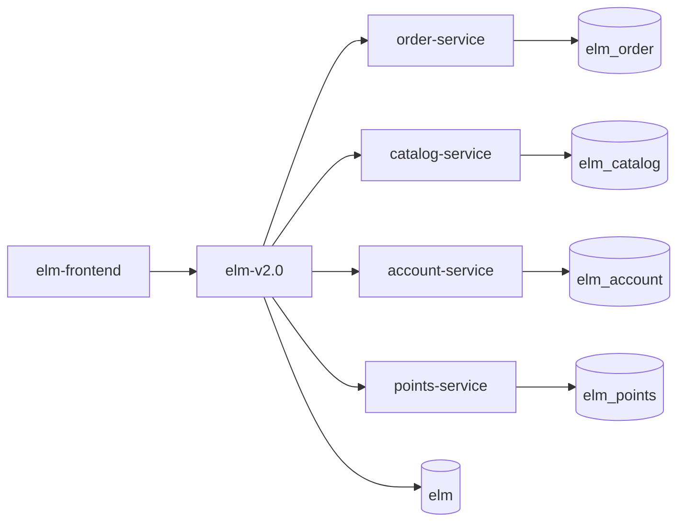

# ELM 微服务实践项目（TJU SE）

本仓库当前以 `elm-v2.0` 作为统一入口（外部 API 聚合层），内部通过 RestTemplate 调用 4 个已拆分微服务：`points-service`、`account-service`、`catalog-service`、`order-service`。

## 1. 微服务业务调用流程

### 1.1 下单链路（创建订单）

1. 前端调用 `elm-v2.0`：`POST /elm/api/orders`
2. `elm-v2.0` 校验用户、地址、购物车
3. `elm-v2.0 -> catalog-service`：查询商家/菜品、预占库存
4. `elm-v2.0 -> account-service`：扣钱包、核销券
5. `elm-v2.0 -> points-service`：冻结并扣减积分（如使用积分）
6. `elm-v2.0 -> order-service`：创建订单主记录和明细
7. `elm-v2.0 -> order-service`：清理购物车
8. 返回下单结果给前端

### 1.2 取消订单链路

1. 前端调用 `elm-v2.0`：`POST /elm/api/orders/{id}/cancel`
2. `elm-v2.0 -> account-service`：退款钱包、回滚券
3. `elm-v2.0 -> points-service`：积分返还/回滚
4. `elm-v2.0 -> catalog-service`：库存回补
5. `elm-v2.0 -> order-service`：订单状态改为取消
6. 返回取消结果

### 1.3 订单完成与评价链路

1. 前端更新订单状态或提交评价到 `elm-v2.0`
2. `elm-v2.0 -> order-service`：更新订单/评价数据
3. `elm-v2.0` 写 Outbox 事件（订单完成积分、评价积分）
4. Outbox 调度后 `elm-v2.0 -> points-service` 发放积分

### 1.4 服务拓扑（逻辑）



## 2. 服务边界（业务职责）

- `elm-v2.0`：外部 API、鉴权上下文、跨域编排、兼容层、Outbox
- `order-service`：订单、订单明细、地址、购物车、评价
- `catalog-service`：商家、菜品、库存预占/回补
- `account-service`：钱包、交易、券核销与回滚
- `points-service`：积分账户、交易、规则

## 3. 统一 Docker 部署

### 3.1 准备环境变量

复制示例配置：

```bash
cp .env.example .env
```

按需修改 `.env` 中的敏感信息（数据库密码、内部 token）。

### 3.2 一键启动

```bash
docker compose up -d --build
```

启动后访问：

- 前端：`http://localhost`
- 聚合 API：`http://localhost:8080/elm`
- points-service：`http://localhost:8081/elm`
- account-service：`http://localhost:8082/elm`
- catalog-service：`http://localhost:8083/elm`
- order-service：`http://localhost:8084/elm`

### 3.3 停止与清理

```bash
docker compose down
```

如需清理数据库卷：

```bash
docker compose down -v
```

### 3.4 首次启动失败排查（MySQL 未初始化）

如果出现“表不存在/服务反复重启”，通常是旧 `mysql-data` 卷导致初始化脚本未重跑。处理方式：

```bash
docker compose down -v
docker compose up -d --build
```

说明：

- 当前编排新增了 `mysql-init` 一次性初始化服务，会显式创建 `elm*` schema
- 各服务 `DB_URL` 也开启了 `createDatabaseIfNotExist=true` 作为兜底

## 4. 部署说明

- 所有服务统一由根目录 `docker-compose.yml` 编排
- MySQL 使用 `docker/mysql/init/01-create-schemas.sql` 初始化多 schema：
  - `elm`
  - `elm_order`
  - `elm_catalog`
  - `elm_account`
  - `elm_points`
- 微服务容器间调用全部走 Docker 网络服务名（如 `http://order-service:8084/elm`）

## 5. 代码目录

- `elm-v2.0/`：聚合层（对前端开放）
- `elm-microservice/order-service/`
- `elm-microservice/catalog-service/`
- `elm-microservice/account-service/`
- `elm-microservice/points-service/`
- `docker-compose.yml`：统一部署入口
